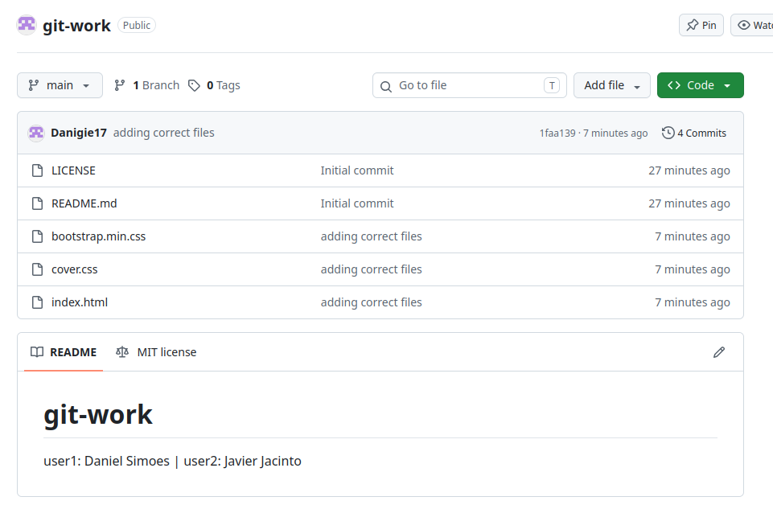
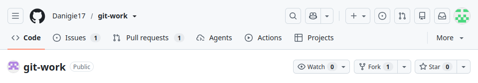
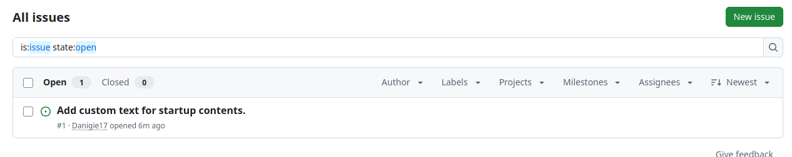
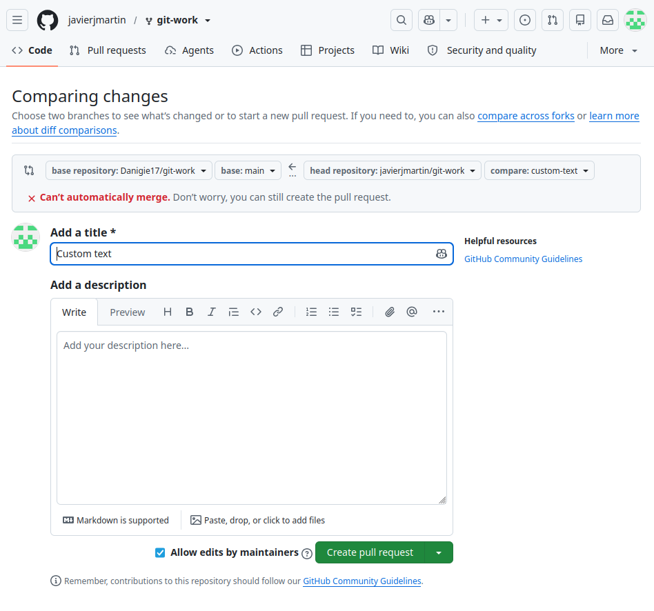
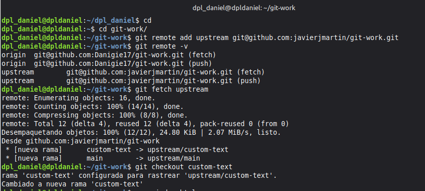
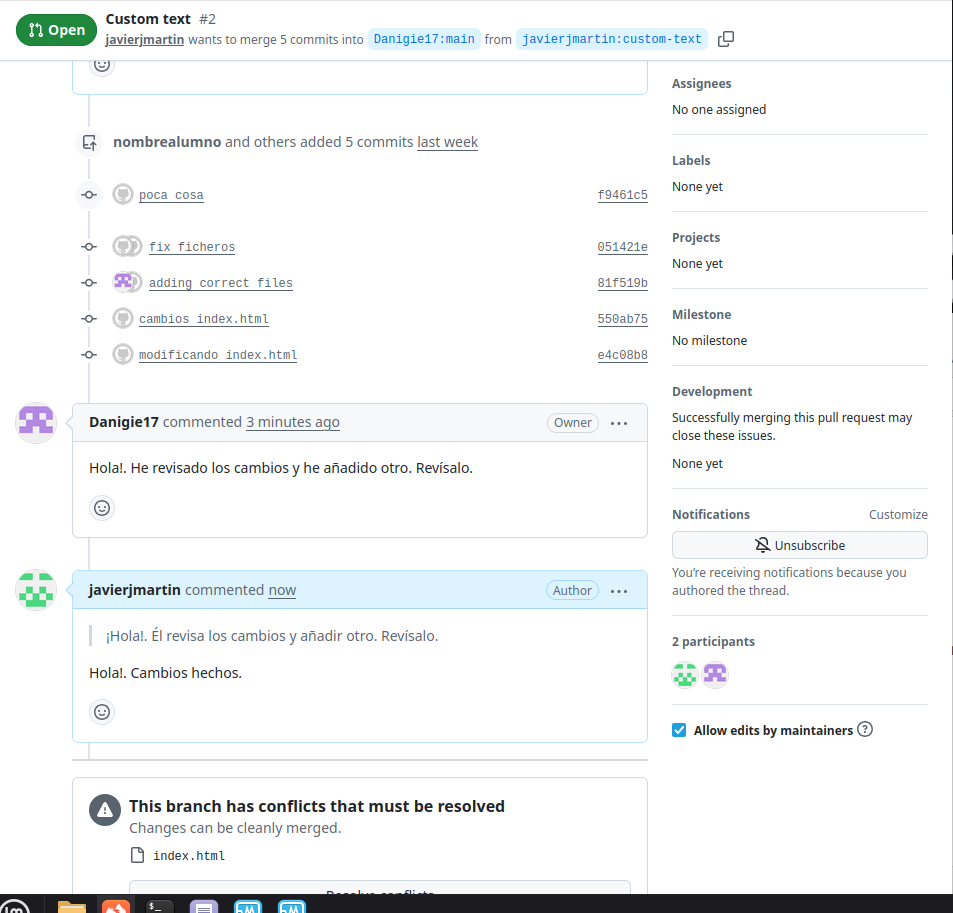
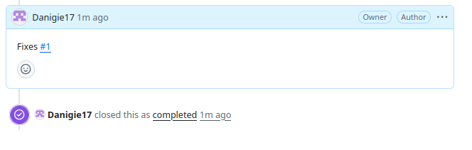

# INFORME DE PRÁCTICA: DESARROLLO COLABORATIVO CON GIT Y GITHUB

***Nombre:*** Daniel Simoes | Javier Jacinto

***Curso:*** 2º de Ciclo Superior de Desarrollo de Aplicaciones Web.

### ÍNDICE

+ [Introducción](#id1)
+ [Objetivos](#id2)
+ [Material empleado](#id3)
+ [Desarrollo](#id4)
+ [Conclusiones](#id5)

#### ***Introducción***. 

El desarrollo de aplicaciones web actual exige metodologías de trabajo ágiles y herramientas robustas que permitan la colaboración transparente entre múltiples programadores. Git, como sistema de control de versiones distribuido, y GitHub, como plataforma de alojamiento de repositorios basados en la nube, representan el estándar de la industria. En esta práctica se aborda el flujo de trabajo denominado "Fork & Pull Request", que permite la integración de código mediante la bifurcación de proyectos, la asignación de tareas a través de sistemas de incidencias (Issues), la revisión por pares del código (Code Review) y la resolución controlada de conflictos de fusión de código que surgen al manipular simultáneamente los mismos ficheros.

#### ***Objetivos***. 

* Comprender y aplicar de forma práctica el flujo de trabajo colaborativo mediante "Fork & Pull Request" en plataformas de desarrollo de software.
* Administrar tareas pendientes y coordinar el desarrollo de características del software empleando las funcionalidades de "Issues" de GitHub.
* Experimentar la simulación de revisiones de código, comentarios y actualización en vivo de Pull Requests (PRs).
* Aprender a identificar, analizar y resolver un conflicto técnico de Git originado por modificaciones concurrentes en el mismo archivo y la misma línea de código.
* Dominar los conceptos de marcado de software a través de etiquetas de Git (Git Tags) y el despliegue formal de versiones mediante "Releases" de producción.

#### ***Material empleado***. 

* **Hardware:** Dos ordenadores personales con conexión a Internet de banda ancha activa.
* **Software:**
  * Sistema Operativo: Windows, macOS o GNU/Linux.
  * Consola o Terminal del Sistema (Bash, Zsh, Git Bash o PowerShell).
  * Cliente Git instalado y configurado de manera global en el sistema.
  * Navegador web moderno para acceder a la plataforma de GitHub.
  * Editor de código fuente o IDE (como Visual Studio Code).
* **Configuraciones realizadas:** Configuración de la identidad global del programador en Git mediante consola (`user.name` y `user.email`) para el registro preciso de la autoría de los commits.

#### ***Desarrollo***. 

##### **1. Definición de roles**
Acordamos los roles que adoptará cada miembro de la pareja: una persona asume la identidad de **user1** (dueño del proyecto principal) y la otra la de **user2** (colaborador).

##### **2. Crear repositorio público git-work (user1)**
**user1** accede a su cuenta de GitHub y crea el repositorio central llamado `git-work`. Lo marca como público y lo inicializa con un archivo informativo `README.md` y una licencia libre MIT.

##### **3. Clonar repositorio y subir ficheros iniciales (user1)**
**user1** descarga el repositorio a su ordenador usando la terminal (clonar). Añade los archivos web básicos (`index.html`, `bootstrap.min.css` y `cover.css`), guarda los cambios con un commit y los sube para actualizar la rama principal remota (`main`).

##### **4. Crear un Fork del proyecto (user2)**
**user2** entra al enlace del repositorio de **user1** y pulsa el botón **"Fork"**. De esta forma, genera una copia exacta del proyecto vinculada directamente a su propia cuenta de GitHub.

##### **5. Clonar el Fork localmente y vincular remoto upstream (user2)**
**user2** descarga su copia (fork) al ordenador. Después, usa la terminal para conectar su Git local con el repositorio original de **user1**, guardándolo con el nombre estándar de **upstream**.

##### **6. Creación de la primera Issue en GitHub (user1)**
**user1** abre una tarea pendiente (**Issue #1**) en GitHub llamada *"Add custom text for startup contents"*. Con esto indicamos la necesidad de escribir el contenido de la web.

##### **7. Crear rama de trabajo y personalizar index.html (user2)**
En su ordenador, **user2** crea una rama nueva llamada `custom-text` para trabajar sin romper el diseño principal. Modifica el archivo `index.html` con el texto de una empresa ficticia, guarda el cambio (commit) y sube la rama completa a su GitHub.

##### **8. Envío de un Pull Request a la rama original (user2)**
**user2** entra a GitHub y envía un **Pull Request (PR)** a **user1**. Con esto le pide permiso para incluir sus cambios en la rama `main` del proyecto original.

##### **9. Configurar remoto temporal y revisar el PR en local (user1)**
Para probar los cambios de su compañero, **user1** conecta la terminal con el repositorio de **user2**. Descarga la rama del cambio, revisa que la web funcione bien, hace un pequeño arreglo local en el archivo y sube el cambio para añadirlo directamente al PR.

##### **10. Conversación y adición de modificaciones sobre el PR (Ambos)**
Usamos los comentarios del Pull Request en GitHub para hablar sobre el texto de la web. Para simular un flujo real, ambos hacemos algún cambio extra desde nuestros ordenadores y lo subimos, lo que actualiza el hilo del PR automáticamente.

##### **11. Aprobación del PR, cierre de Issue #1 y actualización local (user1)**
**user1** acepta los cambios pulsando el botón **"Merge pull request"** en GitHub. La Issue #1 se cierra de forma explícita. Después, **user1** regresa a su rama `main` local en la terminal y descarga los cambios definitivos que acabamos de consolidar en la nube.

##### **12. Incorporación de cambios desde upstream (user2)**
**user2** actualiza su entorno tras la fusión. Se sitúa en su rama `main` local, descarga las nuevas modificaciones unificadas desde el repositorio de **user1** (remoto upstream) y realiza una fusión limpia.

#### ***Conclusión***. 

Al terminar esta práctica, aprendimos a trabajar en paralelo sin interferir en el código de los demás gracias al uso de ramas y forks. Además, entendimos la importancia de la revisión por pares mediante los "Pull Requests" y supimos cómo solucionar los conflictos de código que surgen de forma natural en el trabajo diario. Finalmente, comprendimos cómo organizar y documentar el lanzamiento de versiones en producción utilizando etiquetas y publicaciones formales en GitHub.
